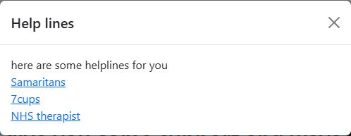
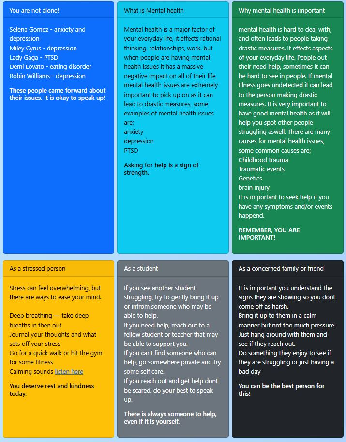
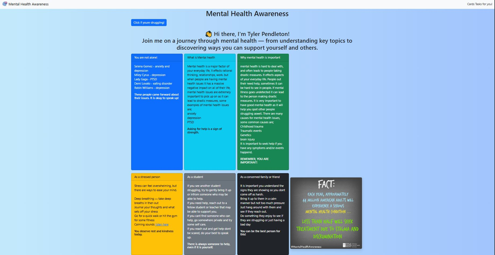

# Individual-Formative-Assignment
This is my first assignment at code Institute

## project overview
This website is about mental health awareness, mental health issues are one of the hardest things in life to deal with.
some people are to scared to come forward with their issues so this website is to support these people with how to deal
with these things and how to spot their actions.

## user value
this website can be used for visitors to gain a clear understanding about mental health topics.

## key features
Responsive design
easily navigated
modal for instant support
comferting colours
cosistant contrast
favicon
checklist for quick support

## deployment details
https://iwillmineya.github.io/Individual-Formative-Assignment/ 

is hosted by github pages

## screenshots

> the Modal is a very important part of this

## Attributions
-bootstrap ~ responsive layout
-imgages ~ royalty-free google images
-favicon ~ flaticon
-ai usage ~ copilot, grammar checking, suggestions to appeal

## AI Reflection
i used ai to support me through it, for example, getting the boxes close together, 
suggestions to make the website appear prettier and to check my grammar

Colour contrast tested with WebAIM Contrast Checker

Code ran through W3C HTML Validator
